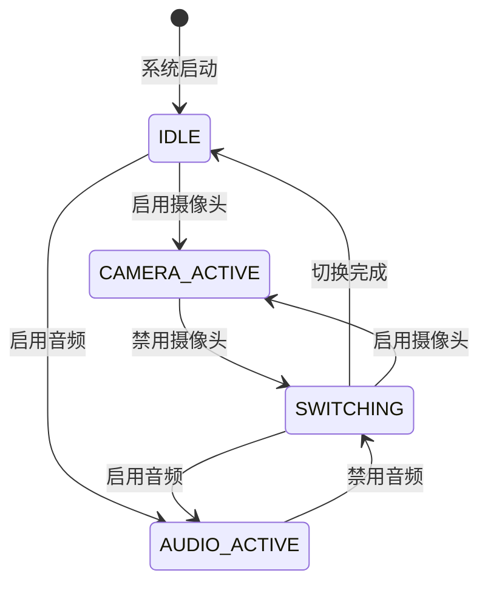

# 摄像头开关功能文档

## 概述

摄像头开关功能是小智AI系统中的一个重要特性，允许动态启用和禁用摄像头，以优化资源使用和避免与音频系统的冲突。此功能仅在 `bread-compact-wifi-s3cam` 开发板上可用。

## 功能特性

### 1. 动态资源管理
- **智能切换**：在摄像头和音频系统之间智能分配共享资源
- **无缝转换**：启用/禁用过程平滑，不影响系统稳定性
- **资源保护**：防止资源冲突导致的系统异常

### 2. 状态监控
- **实时状态**：随时查询摄像头当前状态
- **资源状态**：监控共享资源的使用情况
- **错误检测**：自动检测和报告资源冲突

### 3. 多种控制方式
- **MCP接口**：AI可通过MCP命令控制
- **Web界面**：用户可通过浏览器控制
- **程序接口**：开发者可通过API控制

## 技术原理

### 资源冲突分析

ESP32-S3的某些GPIO引脚在摄像头和音频系统之间共享：

| GPIO | 摄像头用途 | 音频用途 | 冲突类型 |
|------|------------|----------|----------|
| 19 | Y4数据线 | I2S数据 | 直接冲突 |
| 20 | Y3数据线 | I2S时钟 | 直接冲突 |
| 其他 | 控制信号 | 控制信号 | 间接冲突 |

### 资源管理策略

```cpp
typedef enum {
    RESOURCE_IDLE = 0,        // 资源空闲
    RESOURCE_AUDIO_ACTIVE,    // 音频系统占用
    RESOURCE_CAMERA_ACTIVE,   // 摄像头系统占用
    RESOURCE_SWITCHING        // 正在切换状态
} resource_state_t;
```

### 状态转换图



## API接口

### C++ 接口

#### 基本控制

```cpp
#include "camera/camera_resource_manager.h"

// 获取资源管理器实例
auto* resource_manager = CameraResourceManager::GetInstance();

// 启用摄像头
bool success = resource_manager->SetCameraEnabled(true);

// 禁用摄像头
bool success = resource_manager->SetCameraEnabled(false);

// 检查摄像头状态
bool enabled = resource_manager->IsCameraEnabled();

// 获取资源状态
resource_state_t state = resource_manager->GetResourceState();
```

#### 高级控制

```cpp
// 锁定资源给摄像头使用
bool success = resource_manager->LockResourceForCamera();

// 锁定资源给音频使用
bool success = resource_manager->LockResourceForAudio();

// 释放资源
resource_manager->ReleaseResource();

// 检查资源是否可用
bool available = resource_manager->IsResourceAvailable();
```

#### 状态监听

```cpp
// 注册状态变化回调
resource_manager->RegisterStateChangeCallback([](resource_state_t old_state, resource_state_t new_state) {
    ESP_LOGI("APP", "Resource state changed from %d to %d", old_state, new_state);
});
```

### MCP接口

#### 摄像头开关工具

**工具名称**：`self.camera.switch`

**功能**：启用或禁用摄像头

**参数**：
- `enabled` (必需): 布尔值，true为启用，false为禁用

**返回值**：
- `success`: 布尔值，操作是否成功
- `message`: 字符串，操作结果描述
- `current_state`: 字符串，当前摄像头状态

**示例调用**：

启用摄像头：
```json
{
  "jsonrpc": "2.0",
  "method": "tools/call",
  "params": {
    "name": "self.camera.switch",
    "arguments": {
      "enabled": true
    }
  },
  "id": 1
}
```

成功响应：
```json
{
  "jsonrpc": "2.0",
  "id": 1,
  "result": {
    "content": [
      {
        "type": "text",
        "text": "{\"success\": true, \"message\": \"Camera enabled successfully\", \"current_state\": \"enabled\"}"
      }
    ],
    "isError": false
  }
}
```

禁用摄像头：
```json
{
  "jsonrpc": "2.0",
  "method": "tools/call",
  "params": {
    "name": "self.camera.switch",
    "arguments": {
      "enabled": false
    }
  },
  "id": 2
}
```

#### 状态查询工具

**工具名称**：`self.camera.get_status`

**功能**：获取摄像头和资源管理器的详细状态

**参数**：无

**返回值**：
- `camera_enabled`: 摄像头是否启用
- `resource_state`: 当前资源状态
- `camera_model`: 检测到的摄像头型号
- `initialization_status`: 初始化状态

**示例调用**：
```json
{
  "jsonrpc": "2.0",
  "method": "tools/call",
  "params": {
    "name": "self.camera.get_status",
    "arguments": {}
  },
  "id": 3
}
```

响应示例：
```json
{
  "jsonrpc": "2.0",
  "id": 3,
  "result": {
    "content": [
      {
        "type": "text",
        "text": "{\"camera_enabled\": true, \"resource_state\": \"camera_active\", \"camera_model\": \"OV2640\", \"initialization_status\": \"success\"}"
      }
    ],
    "isError": false
  }
}
```

## Web界面集成

### 摄像头控制面板

Web界面提供直观的摄像头控制：

1. **开关按钮**：一键启用/禁用摄像头
2. **状态指示器**：实时显示摄像头和资源状态
3. **实时预览**：摄像头启用时显示实时画面
4. **参数调节**：调整摄像头参数（亮度、对比度等）

### JavaScript API

```javascript
// 启用摄像头
async function enableCamera() {
    const response = await fetch('/api/camera/switch', {
        method: 'POST',
        headers: { 'Content-Type': 'application/json' },
        body: JSON.stringify({ enabled: true })
    });
    return await response.json();
}

// 禁用摄像头
async function disableCamera() {
    const response = await fetch('/api/camera/switch', {
        method: 'POST',
        headers: { 'Content-Type': 'application/json' },
        body: JSON.stringify({ enabled: false })
    });
    return await response.json();
}

// 获取摄像头状态
async function getCameraStatus() {
    const response = await fetch('/api/camera/status');
    return await response.json();
}
```

## 使用场景

### 1. 节能模式
当不需要摄像头功能时，可以禁用摄像头以节省电力：

```cpp
// 进入节能模式
resource_manager->SetCameraEnabled(false);
ESP_LOGI("POWER", "Camera disabled for power saving");
```

### 2. 音频优先模式
在需要高质量音频处理时，禁用摄像头以释放资源：

```cpp
// 启用高质量音频模式
if (resource_manager->SetCameraEnabled(false)) {
    // 配置高质量音频参数
    ConfigureHighQualityAudio();
}
```

### 3. 动态功能切换
根据用户需求动态切换功能：

```cpp
void HandleUserRequest(const std::string& request) {
    if (request == "take_photo") {
        // 启用摄像头进行拍照
        if (resource_manager->SetCameraEnabled(true)) {
            TakePhoto();
        }
    } else if (request == "record_audio") {
        // 禁用摄像头进行录音
        if (resource_manager->SetCameraEnabled(false)) {
            StartAudioRecording();
        }
    }
}
```

### 4. AI智能控制
AI可以根据对话内容智能控制摄像头：

```json
// AI检测到需要视觉功能的请求
{
  "user_message": "帮我看看这是什么东西",
  "ai_action": {
    "tool": "self.camera.switch",
    "params": { "enabled": true }
  }
}
```

## 错误处理

### 常见错误类型

1. **资源冲突错误**
   - 错误码：`RESOURCE_CONFLICT`
   - 原因：尝试在资源被占用时切换状态
   - 解决：等待资源释放或强制释放

2. **硬件初始化错误**
   - 错误码：`HARDWARE_INIT_FAILED`
   - 原因：摄像头硬件初始化失败
   - 解决：检查硬件连接和配置

3. **状态转换超时**
   - 错误码：`STATE_TRANSITION_TIMEOUT`
   - 原因：状态切换过程超时
   - 解决：重置资源管理器状态

### 错误处理示例

```cpp
bool EnableCameraWithRetry(int max_retries = 3) {
    for (int i = 0; i < max_retries; i++) {
        if (resource_manager->SetCameraEnabled(true)) {
            return true;
        }
        
        // 等待一段时间后重试
        vTaskDelay(pdMS_TO_TICKS(1000));
        
        // 如果是资源冲突，尝试强制释放
        if (resource_manager->GetResourceState() != RESOURCE_IDLE) {
            resource_manager->ReleaseResource();
        }
    }
    
    ESP_LOGE("CAMERA", "Failed to enable camera after %d retries", max_retries);
    return false;
}
```

## 性能优化

### 1. 快速切换
- 预分配资源缓冲区
- 优化GPIO配置序列
- 减少不必要的延迟

### 2. 内存管理
- 及时释放摄像头帧缓冲区
- 优化资源管理器内存使用
- 避免内存碎片

### 3. 并发控制
- 使用FreeRTOS互斥锁保护共享资源
- 避免死锁和竞态条件
- 优化任务优先级

## 调试和监控

### 日志输出

启用详细日志以监控摄像头开关过程：

```cpp
// 在 menuconfig 中启用
CONFIG_LOG_DEFAULT_LEVEL_DEBUG=y
CONFIG_CAMERA_RESOURCE_MANAGER_DEBUG=y
```

### 状态监控

```cpp
// 定期输出状态信息
void PrintResourceStatus() {
    resource_state_t state = resource_manager->GetResourceState();
    bool camera_enabled = resource_manager->IsCameraEnabled();
    
    ESP_LOGI("STATUS", "Resource State: %d, Camera Enabled: %s", 
             state, camera_enabled ? "true" : "false");
}
```

### 性能测量

```cpp
// 测量切换时间
uint32_t start_time = esp_timer_get_time();
bool success = resource_manager->SetCameraEnabled(true);
uint32_t switch_time = esp_timer_get_time() - start_time;

ESP_LOGI("PERF", "Camera switch took %lu microseconds", switch_time);
```

## 最佳实践

### 1. 资源管理
- 始终检查操作返回值
- 在不需要时及时释放资源
- 避免频繁切换状态

### 2. 错误处理
- 实现重试机制
- 提供用户友好的错误信息
- 记录详细的错误日志

### 3. 性能优化
- 预测用户需求，提前准备资源
- 使用异步操作避免阻塞
- 监控资源使用情况

### 4. 用户体验
- 提供清晰的状态反馈
- 实现平滑的状态转换
- 支持快速响应用户操作

## 故障排除

### 问题：摄像头无法启用

**可能原因**：
1. 硬件连接问题
2. 资源被其他组件占用
3. 初始化参数错误

**解决步骤**：
1. 检查硬件连接和供电
2. 查看资源管理器状态
3. 检查配置参数
4. 查看详细错误日志

### 问题：状态切换缓慢

**可能原因**：
1. GPIO配置延迟
2. 资源释放不及时
3. 系统负载过高

**解决步骤**：
1. 优化GPIO配置序列
2. 检查资源释放逻辑
3. 调整任务优先级
4. 减少系统负载

### 问题：资源冲突

**可能原因**：
1. 多个组件同时访问资源
2. 资源管理器状态异常
3. 并发控制问题

**解决步骤**：
1. 检查资源访问逻辑
2. 重置资源管理器
3. 加强并发控制
4. 审查代码逻辑

## 更新历史

### v2.0.0
- 初始版本发布
- 实现基本的摄像头开关功能
- 支持MCP和Web界面控制

### v2.0.1
- 优化状态切换性能
- 增强错误处理机制
- 添加详细的状态监控

### v2.1.0
- 支持异步状态切换
- 添加状态变化回调
- 优化内存使用